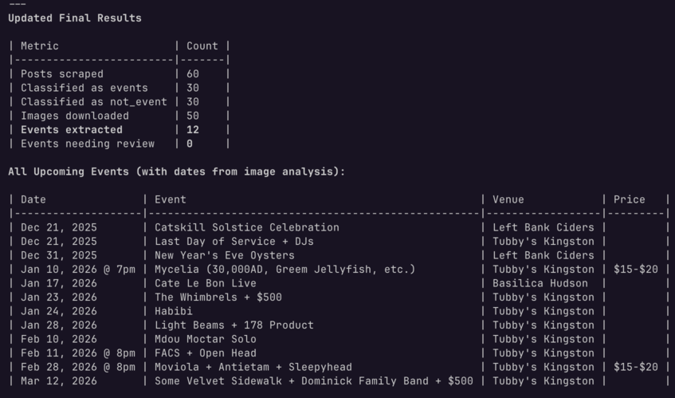

# Local Media Tools



A Claude Code plugin for scraping local events from Instagram, Facebook, and web sources. Get structured JSON data for your own workflows.

**Created by [Aniket Panjwani](https://www.youtube.com/@aniketapanjwani)**

> 💡 **Non-technical?** [Book a consultation](https://tidycal.com/aniketpanjwani/local-media-tools-consultation) for guided setup. You'll leave ready to scrape events from any Instagram profile or webpage yourself.

## About

Local Media Tools scrapes event data from configured sources and stores it in SQLite. You configure your sources (Instagram accounts, Facebook pages, web aggregators), run `/newsletter-events:research` to scrape, and `/newsletter-events:write` to generate formatted newsletters.

### What It Does

1. **Scrape Instagram** - Public profiles via ScrapeCreators API (handles multi-event posts)
2. **Scrape Facebook** - Event pages and location-based discovery
3. **Scrape Web Aggregators** - Event listing websites via Firecrawl
4. **Deduplicate** - Fuzzy matching to merge duplicate events/venues
5. **Store in SQLite** - Normalized database at `~/.config/local-media-tools/data/events.db`
6. **Generate Newsletters** - Markdown output with natural language formatting preferences

## Quick Start

### Installation

```bash
/plugin marketplace add aniketpanjwani/local_media_tools
/plugin install newsletter-events
/newsletter-events:setup
```

The `/newsletter-events:setup` command will guide you through:
1. Installing runtime dependencies (uv, bun)
2. Installing Python and Node packages
3. Creating config directory at `~/.config/local-media-tools/`
4. Configuring your API keys

### After Setup

1. **Get API key** at [scrapecreators.com](https://scrapecreators.com) (required for Instagram)
2. **Add key** to `~/.config/local-media-tools/.env`: `SCRAPECREATORS_API_KEY=your_key`
3. **Configure sources** in `~/.config/local-media-tools/sources.yaml`
4. **Run scraping**: `/newsletter-events:research`

### Manual Installation (Advanced)

```bash
git clone https://github.com/aniketpanjwani/local_media_tools
cd local_media_tools
./scripts/setup.sh
```

## Requirements

- Python 3.12+
- [uv](https://docs.astral.sh/uv/) - Python package manager
- [bun](https://bun.sh/) - JavaScript runtime (for Facebook page scraping)
- [Claude Code](https://claude.com/claude-code) - CLI tool
- [Chrome MCP Server](https://github.com/anthropics/anthropic-quickstarts/tree/main/mcp-servers/chrome) - For Facebook location-based discovery (optional)

## Usage

```bash
# Setup environment
claude /newsletter-events:setup

# Scrape all configured sources
claude /newsletter-events:research

# Generate newsletter from stored events (output to current directory)
claude /newsletter-events:write

# Configure Facebook location discovery
claude /newsletter-events:setup-location
```

## Configuration

All user configuration is stored in `~/.config/local-media-tools/` and persists across plugin upgrades.

Edit `~/.config/local-media-tools/sources.yaml`:

```yaml
newsletter:
  name: "My Local Events"
  region: "Hudson Valley, NY"
  # Natural language formatting instructions for /write
  formatting_preferences: |
    Organize by date with day headers.
    Use emojis for categories: 🎵 music, 🎨 art.
    Format: **Title** @ Venue | Time | Price

sources:
  instagram:
    enabled: true
    accounts:
      - handle: "local_venue"
        name: "Local Venue"
        type: "music_venue"
        location: "Kingston, NY"

  facebook:
    enabled: true
    pages:
      - url: "https://facebook.com/venue/events"
        name: "The Venue"
    # Location-based discovery (requires Chrome MCP + Facebook login)
    locations:
      - location_id: "111841478834264"
        location_name: "Medellín, Antioquia"
        date_filter: "THIS_WEEK"

  web_aggregators:
    enabled: true
    sources:
      - url: "https://localevents.com"
        name: "Local Events"
        source_type: "listing"
```

### Setting Up Facebook Location Discovery

Facebook location-based discovery uses Chrome MCP to scrape Facebook's events page while logged in:

1. **Install Chrome MCP Server** and ensure it's running
2. **Log into Facebook** in Chrome
3. **Run the setup command**: `/newsletter-events:setup-location`

The discovery process is interactive - Claude navigates to Facebook's events page and you scroll to load more events. This ensures reliable data capture without automated scrolling detection.

## Output

**Events Database:** `~/.config/local-media-tools/data/events.db` (SQLite)
- Normalized schema with `venues`, `events`, `profiles`, and `posts` tables
- Instagram posts linked to extracted events for traceability
- Venue deduplication via Instagram handle + fuzzy name matching (85% threshold)
- Query by date range, source, or category

**Newsletters:** Output to current working directory as `newsletter_YYYY-MM-DD.md`
- Generated by `/newsletter-events:write` command
- Formatted according to your `formatting_preferences`

## Directory Structure

**Plugin (code/dependencies):** `~/.claude/plugins/cache/local-media-tools/newsletter-events/{version}/`

**User Config (persists across upgrades):** `~/.config/local-media-tools/`
```
~/.config/local-media-tools/
├── .env                    # API keys (SCRAPECREATORS_API_KEY, FIRECRAWL_API_KEY)
├── sources.yaml            # Event source configuration
└── data/
    ├── events.db           # SQLite database of scraped events
    ├── raw/                # Raw API responses
    └── images/             # Downloaded event images
```

## Project Structure

```
├── .claude-plugin/
│   └── plugin.json         # Plugin manifest
├── commands/
│   ├── research.md         # /newsletter-events:research - Scrape all sources
│   ├── write.md            # /newsletter-events:write - Generate newsletter
│   ├── setup.md            # /newsletter-events:setup - Environment setup
│   └── setup-location.md   # /newsletter-events:setup-location - Facebook location
├── skills/
│   ├── newsletter-events-research/   # Event scraping workflows
│   ├── newsletter-events-write/      # Newsletter generation
│   └── newsletter-events-setup/      # Environment setup
├── config/
│   ├── config_schema.py    # Pydantic config models
│   └── sources.example.yaml
├── schemas/
│   ├── event.py            # Event/Venue/InstagramPost/InstagramProfile Pydantic models
│   ├── sqlite_storage.py   # SQLite backend with venue deduplication and schema migrations
│   └── storage.py          # Atomic file I/O (legacy JSON)
├── scripts/
│   ├── paths.py            # Centralized path resolver
│   ├── scrape_instagram.py # ScrapeCreators API client
│   ├── scrape_facebook.js  # Facebook page scraper (bun/Node.js)
│   ├── scrape_firecrawl.py # Web aggregator scraper
│   ├── facebook_bridge.py  # Python-to-JS subprocess bridge
│   ├── facebook_discover.py # Facebook location-based utilities
│   └── migrate_json_to_sqlite.py  # Migration script
└── tests/
```

## Limitations

**Facebook page scraper:** Uses [facebook-event-scraper](https://github.com/francescov1/facebook-event-scraper) which scrapes public pages without an official API. This can be unreliable:
- Only works for public events
- May break when Facebook changes their HTML structure
- Rate limiting and bot detection may block requests

**Facebook location discovery:** Uses Chrome MCP to scrape while logged in:
- Requires Chrome browser with active Facebook session
- Requires Chrome MCP Server to be running
- Events discovered have sparse data and are marked for review

**Instagram scraper:** Requires a paid ScrapeCreators API key. Rate limits apply per your plan.

**Web aggregators:** Requires a Firecrawl API key. Only needed if using web aggregator sources.

## Development

```bash
# Run tests
uv run pytest tests/ -v

# Install dependencies manually
uv sync
bun install
```

## Support & Contact

- **Email:** [aniket@contentquant.io](mailto:aniket@contentquant.io)
- **YouTube:** [@aniketapanjwani](https://www.youtube.com/@aniketapanjwani)

## Author

**Aniket Panjwani** - Building tools for local media and hyperlocal journalism.

## License

MIT
